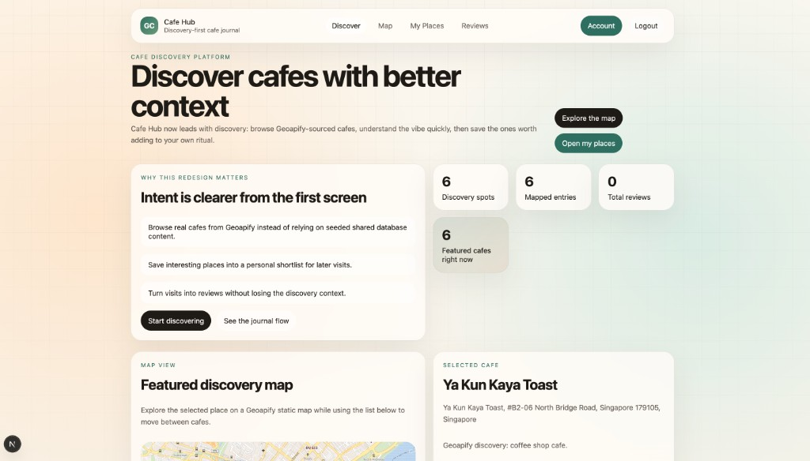
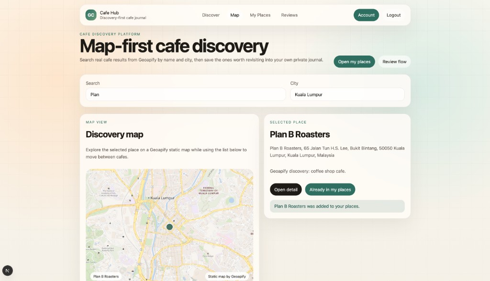
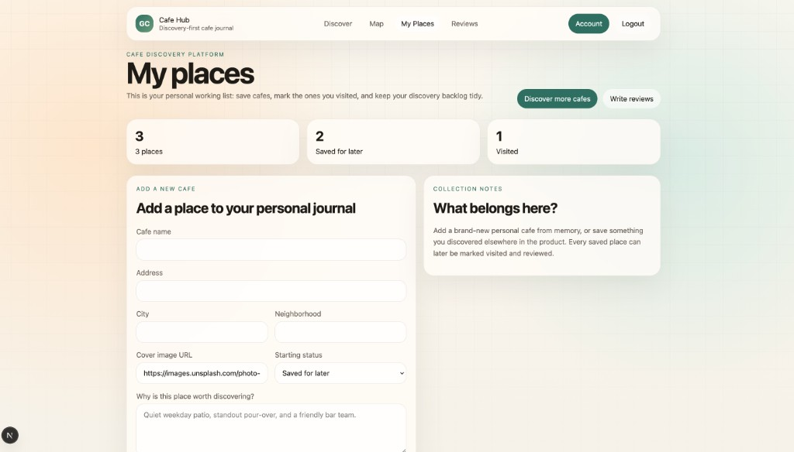
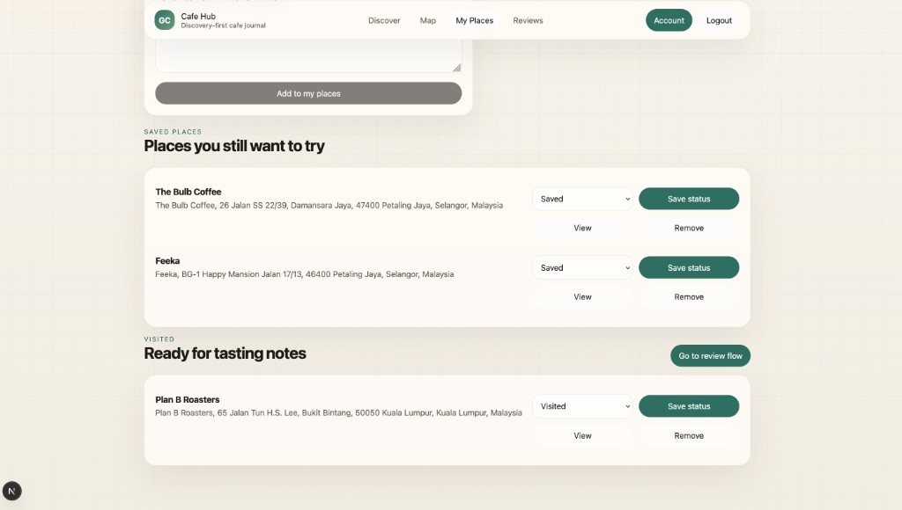
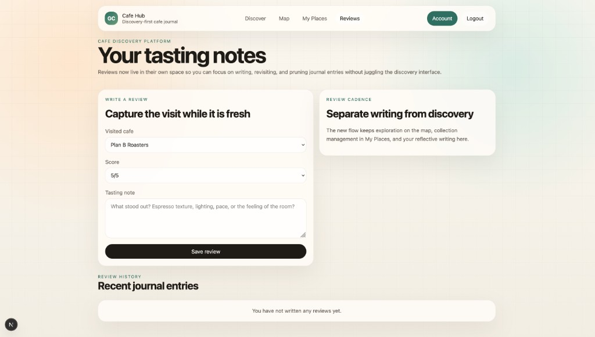

# go-cafe



`go-cafe` is a cafe discovery and rating project with a Go backend and a frontend app.
This README is the live source of truth for architecture, database requirements, and backend/frontend contracts.
The current product experience is organized around discovery-first browsing, personal place management, and post-visit tasting notes.

## Product screenshots

Landing and featured discovery on `/`:


Map-first search flow on `/map`:



Personal collection management on `/my-places`:



Saved and visited state management within `/my-places`:



Dedicated review writing and history on `/reviews`:



## Living document protocol

Update this README in the same pull request whenever any of the following changes:

- API routes, request/response fields, auth behavior, or status codes.
- Database schema, migrations, relationships, or data constraints.
- Cross-service architecture decisions (new modules, service boundaries, deployment flow).
- Environment variables, runtime prerequisites, or local setup commands.

When updating:

1. Update the relevant section(s) in this README.
2. Add a short note in `## Change log for requirements`.
3. If frontend impact exists, update `## Backend-Frontend contract`.

## Repository layout

```text
go-cafe/
  Makefile    # Root orchestration helpers (run both apps, teardown)
  backend/    # Go API server, migrations, tests, Docker assets
  frontend/   # Next.js frontend app
  docs/       # Shared documentation assets
```

## Current architecture

### Backend (implemented)

- Language/runtime: Go `1.25.7`
- HTTP router: `chi`
- ORM and DB layer: `gorm` + PostgreSQL driver
- Auth: JWT (`HS256`) with middleware-based route protection
- Migrations: `golang-migrate` (SQL files in `backend/migrations`)
- API docs: Swagger UI exposed at `/swagger/*`

Layering used in backend packages:

- `handler` layer: HTTP input/output and status code mapping.
- `service` layer: business rules (ownership checks, orchestration).
- `repository` layer: persistence with GORM.
- `models` layer: DB/JSON shape.

Flow:

1. `cmd/api` bootstraps config and DB connection.
2. `internal/server` wires repositories, services, handlers, and routes.
3. Protected routes use JWT middleware and user ID from request context.

### Frontend (implemented)

- Framework/runtime: Next.js (App Router), React
- Current app scope:
  - Discovery-first landing page at `/`
  - Map-based public browsing at `/map`
  - Cafe detail pages at `/cafes/[id]`
  - Personal saved/visited collection at `/my-places`
  - Review writing/history at `/reviews`
  - Dedicated auth screen at `/auth`
  - Public discovery now reads from Geoapify Places instead of shared database-seeded cafes
- API client location: `frontend/lib/api/` with a compatibility export at `frontend/lib/api.js`
- Proxy route to backend API: `frontend/app/api/backend/[...path]/route.js`
- Validation config:
  - ESLint flat config at `frontend/eslint.config.mjs`
  - Frontend lint command: `cd frontend && npm run lint`
- Environment files:
  - `frontend/.env`
  - `frontend/.env.example`
  - `frontend/.env.exmaple` (kept for compatibility with requested filename)

## Backend-Frontend contract

Base API path: `/api/v1`

Auth:

- JWT is returned by login/register.
- Frontend should send `Authorization: Bearer <token>` for protected endpoints.
- Protected endpoints return `401` when token is missing/invalid.
- User-scoped endpoints can return `403` when authenticated user does not own the resource.
- Next.js proxy resolves backend base URL from `API_BASE_URL`, then `NEXT_PUBLIC_API_BASE_URL`, then `http://localhost:8080`.
- Frontend browser calls `/api/backend/*` and Next.js forwards to backend `/api/v1/*`.

### Auth endpoints

- `POST /api/v1/auth/register`
  - Request: `email`, `name`, `password`
  - Response: `201` with `token`, `expires_at`
- `POST /api/v1/auth/login`
  - Request: `email`, `password`
  - Response: `200` with `token`, `expires_at`

### User endpoints

- `GET /api/v1/users/`
- `POST /api/v1/users/`
- `GET /api/v1/users/{id}`
- `PUT /api/v1/users/{id}`
- `DELETE /api/v1/users/{id}`

Note: User CRUD routes are now protected by JWT middleware in route wiring.

### Cafe listing endpoints

Public:

- `GET /api/v1/cafes` (supports query: `query`, `city`, `sort`, `limit`)
- `GET /api/v1/cafes/{id}`
- `GET /api/v1/cafes/autocomplete`
- `GET /api/v1/discovery/cafes/` (Geoapify Places-backed discovery results)
- `GET /api/v1/discovery/cafes/static-map` (Geoapify Static Maps image proxy for discovery screens)
- `GET /api/v1/discovery/cafes/{placeId}` (Geoapify Places-backed detail)

Protected:

- `GET /api/v1/me/cafes` (supports query: `status`, `sort`)
- `POST /api/v1/me/cafes`
- `GET /api/v1/users/{userId}/cafes/` (requires `{userId}` to match JWT subject; supports `status`, `sort`)
- `POST /api/v1/users/{userId}/cafes/` (requires `{userId}` to match JWT subject)
- `PUT /api/v1/cafes/{id}` (owner only)
- `DELETE /api/v1/cafes/{id}` (owner only)

Cafe status rules:

- `visit_status` values: `to_visit`, `visited`.
- Default on create: `to_visit`.
- Discovery surfaces treat `to_visit` as the user-facing "saved" state.
- Ratings can only be created for cafes marked `visited`.
- Invalid status values return `400`.
- Rating create returns `400` with message `cafe must be marked visited before rating` when status is `to_visit`.
- `POST /api/v1/me/cafes` accepts discovery metadata fields: `city`, `neighborhood`, `image_url`, `latitude`, `longitude`.
- `POST /api/v1/me/cafes` can accept `source_cafe_id` when saving a public discovery into a personal collection.
- `POST /api/v1/me/cafes` can accept `source_provider` and `external_place_id` when saving a Geoapify discovery result.
- Public discovery responses include derived `avg_rating` and `review_count`.

Cafe sort options (`sort` query):

- `updated_desc` (default)
- `created_desc`
- `name_asc`
- `name_desc`
- `status_asc`
- `status_desc`

Geoapify discovery options (`GET /api/v1/discovery/cafes/`):

- `query` (free-text place-name search within the discovery area)
- `city`
- `limit`

Geoapify static map options (`GET /api/v1/discovery/cafes/static-map`):

- `point` (repeatable `lat,lon` query values for visible cafes)
- `selected` (`lat,lon` for highlighted cafe marker)
- `width`
- `height`

### Rating endpoints

Public:

- `GET /api/v1/cafes/{id}/ratings/`
- `GET /api/v1/community/places/{placeId}/ratings`
- `GET /api/v1/ratings/{id}`

Protected:

- `GET /api/v1/me/ratings`
- `POST /api/v1/cafes/{id}/ratings/`
- `GET /api/v1/users/{userId}/ratings/` (requires `{userId}` to match JWT subject)
- `PUT /api/v1/ratings/{id}` (owner only)
- `DELETE /api/v1/ratings/{id}` (owner only)

Rating creation rule:

- `POST /api/v1/cafes/{id}/ratings/` returns `400` if the cafe is still `to_visit`.
- `POST /api/v1/cafes/{id}/ratings/` returns `400` if `rating` is outside `1-5`.
- `POST /api/v1/cafes/{id}/ratings/` returns `409` when the same user already reviewed the same cafe.
- `GET /api/v1/cafes/{id}/ratings/` returns community ratings for the root discovery cafe and any saved copies linked by `source_cafe_id`.
- `GET /api/v1/community/places/{placeId}/ratings` returns reviews written against saved cafes linked to the same Geoapify place.

## Database requirements

Database: PostgreSQL

Tables are managed by SQL migrations (not auto-migration at runtime).

Current schema (base tables from `000001_create_gocafe_tables.up.sql` plus later migrations):

- `gocafe_users`
  - `id` (PK), `created_at`, `updated_at`
  - `email` (required, unique)
  - `name`
  - `password_hash`
- `gocafe_cafe_listings`
  - `id` (PK), `created_at`, `updated_at`
  - `user_id` (FK -> `gocafe_users.id`, cascade delete)
  - `name` (required), `address`, `city`, `neighborhood`, `description`, `image_url`
  - `latitude`, `longitude`
  - `source_provider`, `external_place_id`
  - `visit_status` (required; `to_visit` or `visited`; default `to_visit`)
  - `source_cafe_id` (nullable self-reference for personal saved copies of public discoveries)
- `gocafe_ratings`
  - `id` (PK), `created_at`, `updated_at`
  - `user_id` (FK -> `gocafe_users.id`, cascade delete)
  - `cafe_listing_id` (FK -> `gocafe_cafe_listings.id`, cascade delete)
  - `visited_at` (required), `rating` (required, 1-5), `review`

Additional migration:

- `000002_add_visit_status_to_cafe_listings.up.sql`
  - Adds `visit_status` column to `gocafe_cafe_listings`
  - Adds status check constraint (`to_visit`, `visited`)
  - Adds index on `visit_status`
- `000003_add_address_to_cafe_listings.up.sql`
  - Adds `address` column to `gocafe_cafe_listings`
- `000004_add_discovery_fields_and_rating_guardrails.up.sql`
  - Adds `city`, `neighborhood`, `latitude`, `longitude`, `image_url`, and `source_cafe_id`
  - Adds a self-referential FK for `source_cafe_id`
  - Adds index support for discovery filtering
  - Adds a rating range check (`1-5`)
- `000005_add_external_place_source.up.sql`
  - Adds `source_provider` and `external_place_id`
  - Supports saving Geoapify discovery results into personal cafe records without persisting shared community seed cafes

Indexes:

- `gocafe_users.email`
- `gocafe_cafe_listings.user_id`
- `gocafe_cafe_listings.city`
- `gocafe_cafe_listings.external_place_id`
- `gocafe_cafe_listings.source_provider`
- `gocafe_cafe_listings.source_cafe_id`
- `gocafe_cafe_listings.visit_status`
- `gocafe_ratings.user_id`
- `gocafe_ratings.cafe_listing_id`

### Data rules that frontend should assume

- IDs are numeric (`uint` in backend models).
- Date/time fields are serialized as RFC3339 timestamps in JSON.
- Ownership is enforced server-side for update/delete of cafes and ratings.
- Password hash is never exposed in API JSON.
- Discovery cards may include `avg_rating` and `review_count`.
- Public discoveries are original cafes (`source_cafe_id == null`); personal saved copies may point back to the original via `source_cafe_id`.
- Geoapify-sourced discovery results use string `placeId` values in the frontend detail route; saved personal cafes still use numeric DB IDs.

## Environment requirements

Backend reads env vars from `backend/.env` (via `godotenv`):

- `DB_HOST` (required)
- `DB_PORT` (optional, defaults to `5432`)
- `DB_NAME` (required)
- `DB_USER` (required)
- `DB_PASSWORD` (required)
- `DB_SSL` (optional, defaults to `disable`)
- `DB_SSL_ROOT_CERT` (optional, defaults to `global-bundle.pem`)
- `JWT_SECRET` (required)
- `JWT_EXPIRY` (optional, defaults to `24h`)
- `GEOAPIFY_API_KEY` (required for live public discovery from Geoapify Places and address autocomplete)

Reference template: `backend/.env.example`

Frontend env vars (`frontend/.env`):

- `API_BASE_URL` (primary value for Next.js server-side proxy route)
  - Local backend via Docker: `http://localhost:8080`
  - Production backend: `https://<your-backend-domain>`
- `NEXT_PUBLIC_API_BASE_URL` (fallback if `API_BASE_URL` is not set)
- If both are unset, frontend proxy defaults to `http://localhost:8080`.
- The frontend also exposes an internal image proxy at `/api/static-map` so the browser can render Geoapify static maps without receiving the API key directly.

Vercel setup:

- Add `API_BASE_URL` in Project Settings -> Environment Variables.
- Use the same value for Preview/Production (or separate values per environment).

## Local development

From repository root:

```bash
make run

# or run services separately
make help
make run-backend
make run-frontend
make -C backend help
make -C backend run
cd frontend && npm install
cd frontend && npm run dev
```

Notes:

- `make run` / `make up` now starts the backend through `make -C backend run`, which applies pending backend migrations before booting the API.
- `make teardown` / `make down` stops the local frontend/backend processes and removes generated artifacts.
- Without `GEOAPIFY_API_KEY`, discovery endpoints fail closed with `503` and the frontend shows a clear empty/error state instead of reading shared seeded cafes from the application database.

Common backend targets:

- `make -C backend build`
- `make -C backend unit-test`
- `make -C backend integration-test`
- `make -C backend migrate-down`
- `make -C backend docker-up`
- `make -C backend docker-down`
- `make -C backend auth` (prints JWT token)
- `make -C backend teardown` (non-destructive cleanup)
- `make -C backend teardown-reset` (destructive local reset; rolls back migration)

Common frontend commands:

- `cd frontend && npm run dev`
- `cd frontend && npm run lint`
- `cd frontend && npm run build`
- `cd frontend && npm run start`

## Compact backend API verification checklist

Use this before frontend integration to confirm backend contract + persistence behavior.

Prerequisites:

- `make -C backend docker-up`
- `TOKEN=$(make -C backend auth)`

Core persistence checks (POST -> GET, PUT -> GET, DELETE -> GET):

- Auth: register + login return JWT.
- Users: protected CRUD routes require JWT.
- Cafes: Geoapify discovery list under `/discovery/cafes/`, create under `/me/cafes`, list under `/me/cafes`, get by id, update/delete owner-only.
- Ratings: create under `/cafes/{id}/ratings/`, list by cafe, get by id, update/delete owner-only.
- User-scoped legacy routes: `/users/{userId}/cafes/` and `/users/{userId}/ratings/`.

Expected status behavior:

- `200/201/204` on successful operations.
- `400` for malformed payloads/IDs.
- `401` for missing/invalid JWT on protected routes.
- `403` for authenticated but non-owner access on owner-scoped routes.
- `404` for non-existent numeric IDs.

Quick smoke examples:

```bash
# register/login token
make -C backend auth

# create cafe
curl -s -X POST http://localhost:8080/api/v1/me/cafes \
  -H "Authorization: Bearer $TOKEN" \
  -H "Content-Type: application/json" \
  -d '{"name":"Smoke Cafe","address":"123 Test","city":"Seattle","description":"smoke","latitude":47.6205,"longitude":-122.3493}'

# list my cafes (verify stored values)
curl -s http://localhost:8080/api/v1/me/cafes \
  -H "Authorization: Bearer $TOKEN"

# public discovery
curl -s "http://localhost:8080/api/v1/discovery/cafes/?query=smoke&city=singapore"
```

## Definition of done for requirement changes

For any PR that changes behavior across backend/frontend:

- [ ] API contract updates are reflected in this README.
- [ ] DB migration and schema implications are reflected in this README.
- [ ] Auth/authorization changes are reflected in this README.
- [ ] New env vars or setup steps are reflected in this README.
- [ ] Frontend impact and required client updates are explicitly documented.

## Change log for requirements

- `2026-02-16`: Created the initial live requirements README with architecture, API contract, DB schema, environment variables, and maintenance protocol.
- `2026-02-16`: Added compact backend API verification checklist and `make auth` usage to standardize pre-frontend backend validation.
- `2026-02-16`: Reworked frontend into a product-style flow (signup/login, listings CRUD + sorting, review CRUD) and switched API calls through a Next.js proxy route for Vercel compatibility.
- `2026-02-17`: Enhanced frontend visual design with interactive 3D-style motion accents including a spinning teacup and animated ambient elements.
- `2026-02-18`: Added cafe `visit_status` (`to_visit`/`visited`), status-aware cafe filtering/sorting, and backend rule that ratings are allowed only for visited cafes.
- `2026-02-16`: Synced README to latest monorepo state (root Makefile orchestration, Swagger endpoint, frontend proxy behavior, and migration `000002` details).
- `2026-03-26`: Repositioned the product around discovery-first browsing with dedicated landing, map, auth, saved places, review, and cafe detail routes.
- `2026-03-26`: Added public discovery APIs, discovery metadata fields on cafes, `source_cafe_id` support for saved copies, and rating guardrails.
- `2026-03-26`: Updated local validation guidance to use ESLint in the frontend and auto-apply backend migrations during root `make run` startup.
- `2026-03-26`: Switched public discovery away from shared database records to Geoapify Places-backed endpoints, added external place linkage on saved cafes, and cleaned up synthetic validation data from the shared database.
- `2026-03-26`: Replaced the client-side interactive map with Geoapify Static Maps, restored address autocomplete by adding Singapore-aware lookup context, and tightened padding on the My Places and Reviews forms.
- `2026-03-26`: Refreshed README screenshots to match the current discovery-first redesign across the landing, map, My Places, and Reviews flows.
